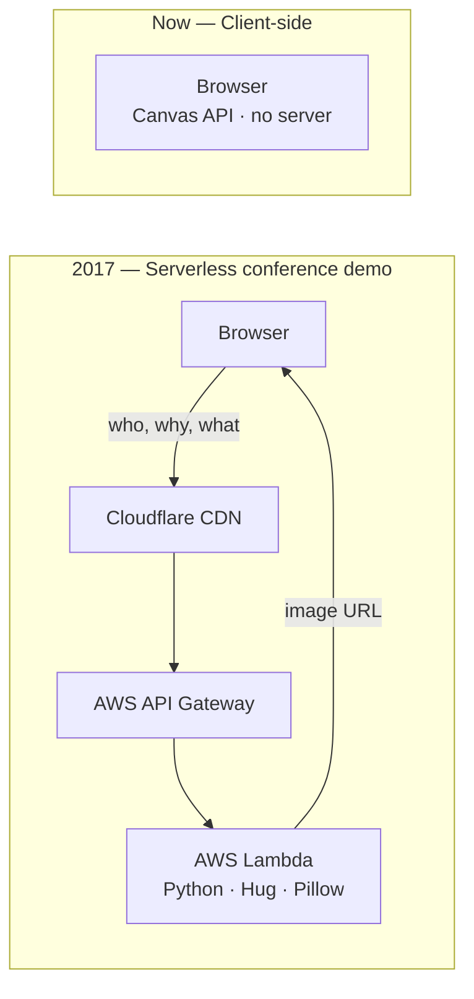

# XKCD Excuse Generator (Client-Side)

Generate your own slacking excuse in XKCD comic style, entirely in the browser.

This is a client-side recreation of [mislavcimpersak's xkcd-excuse-generator](https://github.com/mislavcimpersak/xkcd-excuse-generator) using the HTML5 Canvas API. Single HTML file. No server, no build step, no dependencies.

> **Disclaimer:** Not affiliated with [XKCD](https://xkcd.com), Randall Munroe, or [mislavcimpersak's](https://github.com/mislavcimpersak) original [xkcd-excuse-generator](https://github.com/mislavcimpersak/xkcd-excuse-generator). Built as a fun exploration of how far browser APIs have come in the nearly 10 years since the original. Assembled with AI (GitHub Copilot + Claude Opus 4.6) — no AI involved in image generation. More in the [PRD](PRD.md).

## What it does

You fill in three fields — who's slacking, what's their excuse, what are they shouting — and it draws those words onto the blank [xkcd #303 "Compiling"](https://xkcd.com/303/) template, live as you type. Download as PNG or copy straight to your clipboard.

The 🎲 Random button is worth a mention. The original required a server round-trip per render, so a phrase bank that fires instantly wasn't a natural fit. Here it's just an array and a canvas draw call.

As you type, the URL updates automatically. Whatever's on screen is always shareable.

## URL state and embedding

The current excuse is stored in query parameters as you type:

```
?slacking=programmer&excuse=my+code+is+compiling&shouting=compiling
```

"Copy share link" grabs the current URL. "Copy embed code" generates an iframe snippet:

```html
<iframe src="https://khawkins98.github.io/xkcd-excuse-generator-client/?slacking=programmer&excuse=my+code+is+compiling&shouting=compiling&ui=false" width="413" height="360" frameborder="0" scrolling="no"></iframe>
```

`?ui=false` hides the form and shows only the canvas. The "Hide UI" button does the same thing, and the state carries into any link you share. This approach follows the pattern described in [URL as state management](https://www.allaboutken.com/posts/20251226-url-state-management/).

### The one thing the original could do that this can't

The original API returned deterministic image URLs — hex-encoded, Cloudflare-cached — so you could embed an excuse with a plain `` tag. That's genuinely useful. There's no equivalent here because the image only exists in the browser; an iframe is as close as it gets. For most purposes that's fine, but if you specifically need a static image URL, you need a server.

## Why this exists

[Mislav Cimperšak](https://github.com/mislavcimpersak) built the original in September 2017 for Python meetups in Croatia and Serbia, where he was giving a talk on serverless technology. The excuse generator was the example app. The whole point was the Lambda setup — Python/Pillow on AWS Lambda, packaged with Zappa, fronted by Cloudflare. It was a conference demo first and an excuse generator second.

Here's what that looked like versus this version:



Canvas has been around since 2004 — Apple added it to WebKit for Dashboard widgets, Firefox got it in 2005, IE finally caught up with IE9 in 2011. By 2017 it was just there. Mislav didn't reach for Canvas because he was building a Lambda demo, not a Canvas demo. The tech was available; it wasn't the point.

That said, a couple of specific APIs this version uses genuinely didn't exist in 2017. `navigator.clipboard.write()` with image blobs only landed in Chrome 66 in May 2018. The `FontFace` API for loading custom fonts into a canvas context was available but new enough that betting on it cross-browser would have been a gamble. None of that is why the original was server-side, but the experience here wasn't fully achievable then either.

This was also an experiment in AI-assisted development. Prompting and direction from a human; code almost entirely from the AI (GitHub Copilot in the terminal, powered by Claude Opus 4.6), with only minor corrections needed.

## Running it locally

Font and template image load as relative paths, so opening `index.html` directly via `file://` won't work in most browsers (CORS on local files). Easiest fix:

```bash
npx serve -l tcp://localhost:0
```

Picks a random open port and prints the URL.

## Rendering fidelity

Same `blank_excuse.png` template and `xkcd-script.ttf` font as the original. Text is drawn with Canvas 2D instead of Python's Pillow, so there are small differences in anti-aliasing and kerning. With a handwriting font you'd be hard pressed to notice. If pixel-perfect Pillow output ever matters, a server-side rendering step could be added back.

## Acknowledgements

The original [xkcd #303 ("Compiling")](https://xkcd.com/303/) comic is by Randall Munroe, released under [CC BY-NC 2.5](https://creativecommons.org/licenses/by-nc/2.5/).

[Mislav Cimperšak](https://github.com/mislavcimpersak) built the original [xkcd-excuse-generator](https://github.com/mislavcimpersak/xkcd-excuse-generator) and its [frontend](https://github.com/mislavcimpersak/xkcd-excuse-front). The blank template image and text-placement coordinates come from that work.

The [xkcd-font](https://github.com/ipython/xkcd-font) is by the iPython team, released under [CC BY-NC 3.0](https://creativecommons.org/licenses/by-nc/3.0/).

## License

Released under [CC BY-NC 3.0](https://creativecommons.org/licenses/by-nc/3.0/) to respect the upstream licenses on the comic and font.
