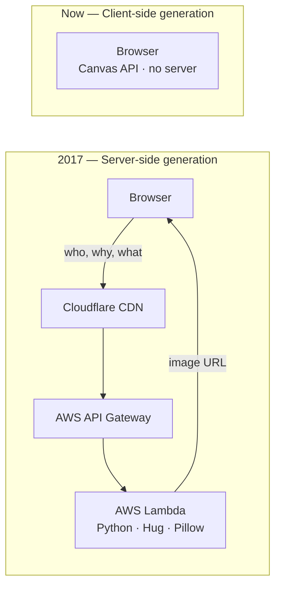

# XKCD Excuse Generator (Client-Side)

Generate your own slacking excuse in XKCD comic style, entirely in the browser.

This is a client-side recreation of [mislavcimpersak's xkcd-excuse-generator](https://github.com/mislavcimpersak/xkcd-excuse-generator) using the HTML5 Canvas API. It runs as a single HTML file with no server, no build step, and no dependencies.

> **Disclaimer:** This project is not affiliated with [XKCD](https://xkcd.com), Randall Munroe, or [mislavcimpersak's](https://github.com/mislavcimpersak) original [xkcd-excuse-generator](https://github.com/mislavcimpersak/xkcd-excuse-generator). It was built as a fun exploration to see how far JavaScript and browser APIs have come in the nearly 10 years since the original was made. Assembled with AI (GitHub Copilot + Claude Opus 4.6) — no AI involved in image generation. You can read more about the approach in the [PRD](PRD.md).

## What it does

You type in three fields (who's slacking, what's their excuse, and what are they shouting) and it draws those words onto the blank [xkcd #303 "Compiling"](https://xkcd.com/303/) comic template. The comic updates live as you type. Once you have something you like, download it as a PNG or copy it straight to your clipboard.

The **🎲 Random** button is a small thing worth mentioning. It wasn't really practical in the original architecture — every render was a server round-trip, so pre-loading a phrase bank and firing one off instantly wasn't a natural fit. Here it's just an array and a canvas draw call, so it's trivial.

## Why this exists

[mislavcimpersak](https://github.com/mislavcimpersak) built the original around 2017, originally as a demo for serverless architecture talks in Croatia and Serbia. At the time, the setup was genuinely clever: a Python function on AWS Lambda using Pillow to composite images, deployed with Zappa, fronted by Cloudflare. For 2017, that was a tidy way to run a stateless image generator at near-zero cost.

Here's what that looked like versus this version:



The serverless approach had real appeal in 2017. Running image generation in a Lambda meant zero servers to manage and costs that scaled to zero when nobody was using it. It was also a neat showcase of what you could do with the then-emerging serverless pattern.

In 2025 that same architecture feels like a lot of moving parts for what turns out to be a few canvas draw calls. `drawImage()` paints the template, `measureText()` checks widths, `fillText()` writes the words. The browser has been able to do all of this for years — it just wasn't as obvious a path back then, and the tooling to work this way has gotten much more comfortable.

This was also an experiment in AI-assisted development. The whole thing was put together using GitHub Copilot in the terminal (powered by Claude Opus 4.6). The prompting and direction came from a human; the actual code and structure came almost entirely from the AI, with only minor corrections needed.

## Running it locally

The font and template image load as relative paths, so opening `index.html` directly via `file://` won't work in most browsers (CORS restrictions). Easiest fix:

```bash
npx serve -l tcp://localhost:0
```

That picks a random open port and prints the URL.

## Rendering fidelity

We use the same `blank_excuse.png` template and the same xkcd-script font as the original. The text is drawn with the Canvas 2D API instead of Python's Pillow, so there are small differences in anti-aliasing and kerning. With a handwriting font like xkcd-script, you'd be hard pressed to spot them. If pixel-perfect Pillow output is ever needed, a server-side rendering step could be added back.

## Acknowledgements

The original [xkcd #303 ("Compiling")](https://xkcd.com/303/) comic is by Randall Munroe, released under [CC BY-NC 2.5](https://creativecommons.org/licenses/by-nc/2.5/).

[mislavcimpersak](https://github.com/mislavcimpersak) (Mislav Cimperšak) built the original [xkcd-excuse-generator](https://github.com/mislavcimpersak/xkcd-excuse-generator) and its [frontend](https://github.com/mislavcimpersak/xkcd-excuse-front). The blank template image and the text-placement coordinates come from that work.

The [xkcd-font](https://github.com/ipython/xkcd-font) is by the iPython team, released under [CC BY-NC 3.0](https://creativecommons.org/licenses/by-nc/3.0/).

## License

Released under [CC BY-NC 3.0](https://creativecommons.org/licenses/by-nc/3.0/) to respect the upstream licenses on the comic and font.

## Running it locally

The font and template image load as relative paths, so opening `index.html` directly via `file://` won't work in most browsers (CORS restrictions). Easiest fix:

```bash
npx serve -l tcp://localhost:0
```

That picks a random open port and prints the URL.

## Rendering fidelity

We use the same `blank_excuse.png` template and the same xkcd-script font as the original. The text is drawn with the Canvas 2D API instead of Python's Pillow, so there are small differences in anti-aliasing and kerning. With a handwriting font like xkcd-script, you'd be hard pressed to spot them. If pixel-perfect Pillow output is ever needed, a server-side rendering step could be added back.

## Acknowledgements

The original [xkcd #303 ("Compiling")](https://xkcd.com/303/) comic is by Randall Munroe, released under [CC BY-NC 2.5](https://creativecommons.org/licenses/by-nc/2.5/).

[mislavcimpersak](https://github.com/mislavcimpersak) (Mislav Cimperšak) built the original [xkcd-excuse-generator](https://github.com/mislavcimpersak/xkcd-excuse-generator) and its [frontend](https://github.com/mislavcimpersak/xkcd-excuse-front). The blank template image and the text-placement coordinates come from that work.

The [xkcd-font](https://github.com/ipython/xkcd-font) is by the iPython team, released under [CC BY-NC 3.0](https://creativecommons.org/licenses/by-nc/3.0/).

## License

Released under [CC BY-NC 3.0](https://creativecommons.org/licenses/by-nc/3.0/) to respect the upstream licenses on the comic and font.
